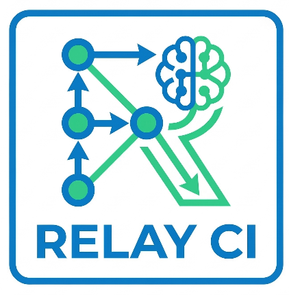

# **Relay CI** - A CI for AI, Built by AI

<p align="center">
  
</p>

## A fast, parallel, AI-native CI system built specifically for Agentic Workflows.

Relay CI is a distributed, DAG-based, containerised CI system built in Go. Pipelines execute in parallel across ephemeral containers.

Build status is reported back to GitHub/GitLab, and every part of the system is reachable by AI agents via a built-in MCP server — so agents can trigger and monitor builds, diagnose failures, suggest efixes, enforce code policies via AI Code and Design reviews, and trigger retries without human intervention.

→ **[Quick Start Guide](QuickStart.md)** — get master, worker, and MCP server running in 5 minutes.

---

## Why Relay CI?

Most CI systems were built for humans reading dashboards. Relay CI is built for the world where AI agents are part of the engineering loop.

| Traditional CI | Relay CI |
|---|---|
| Humans read logs to find failures | Agents call `diagnose_build` and get structured failure analysis |
| Humans retry failed builds | Agents call `retry_build` after auto-applying a fix |
| Humans check code quality manually | Agents run `suggest_fix` and open PRs with corrections |
| Build results live in a web UI | Build results are a first-class API callable by any MCP client |
| CI config is opaque to LLMs | `pipeline.yml` is plain YAML, readable and writable by agents |
| AI Code Review is not native to the CI | AI Code review is part of the CI pipeline and aligned to the way modern AI Agents work |

---

## MCP Server — AI Agent Integration

Relay CI ships with a built-in **MCP (Model Context Protocol) server** that exposes the entire CI system as a set of tools callable by any MCP-compatible AI agent (Claude, GPT-4, custom agents, etc.).

### What agents can do

**Monitor builds in real time**
```
Agent: "Are there any failing builds right now?"
→ get_failed_builds() → structured summary of failures with task-level detail
```

**Diagnose failures automatically**
```
Agent: "Why did build abc123 fail?"
→ diagnose_build(build_id) → which tasks failed, error logs, dependency chain,
                              skipped downstream tasks
```

**Suggest and apply fixes**
```
Agent: "Fix the failing lint task in build abc123"
→ suggest_fix(build_id, task_id) → error type, file:line references,
                                    corrective action
→ Agent edits the code, pushes a fix, retries the build
```

**Enforce code policies**
```
Agent running on every PR:
  1. submit_build() → trigger pipeline
  2. watch_build()  → wait for completion
  3. diagnose_build() → extract lint/security findings
  4. Post review comments with exact file:line violations
  5. Block merge if policy thresholds exceeded
```

**Auto-fix and re-run**
```
Agent workflow:
  1. Build fails on lint errors
  2. Agent reads logs via get_task_logs()
  3. Agent applies fix to source code
  4. Agent calls retry_build() → only failed tasks re-run
  5. Build passes → PR is approved
```

**Code review assistance**
```
Agent: "Review the diff in this PR"
→ submit_build() → triggers review-pr (LLM) + security scanners in parallel
→ get_task_logs(task_id="review-pr") → full LLM review with verdict
→ get_task_logs(task_id="security: trivy") → vulnerability findings
→ Agent posts inline PR comments; build fails if verdict is No/With-fixes
```

### MCP Tools

| Tool | Description |
|---|---|
| `submit_build` | Trigger a build for any repo/branch/commit |
| `get_build` | Full build status with all task states, exit codes, durations |
| `list_builds` | List builds, filterable by state |
| `watch_build` | Poll build progress as a percentage |
| `get_task_logs` | Fetch stdout/stderr/system logs for any task |
| `diagnose_build` | Structured failure analysis — failed tasks, error lines, skipped dependents |
| `suggest_fix` | Analyse a failed task and return error type, location, and fix recommendation |
| `get_failed_builds` | All currently failed builds with failure summaries |
| `retry_build` | Re-run failed tasks only (or full rebuild from scratch) |
| `cancel_build` | Kill a running build |

### Running the MCP Server

```bash
# HTTP mode — remote agents connect over the network
MCP_HTTP_ADDR=:8081 CI_MASTER=localhost:9090 ./bin/ci-mcp

# stdio mode — local MCP clients (Claude Desktop, etc.)
CI_MASTER=localhost:9090 ./bin/ci-mcp
```

Configure in Claude Desktop (`~/.claude/claude_desktop_config.json`):
```json
{
  "mcpServers": {
    "relay-ci": {
      "url": "http://localhost:8081/mcp"
    }
  }
}
```

---

## Architecture

```
Developer opens PR / Agent calls submit_build
              │
              ▼
   ┌─────────────────────┐
   │      ci-master      │
   │  ┌───────────────┐  │
   │  │  MCP Server   │◄─┼── AI Agents (Claude, GPT-4, custom)
   │  └───────┬───────┘  │
   │          │          │
   │  ┌───────▼───────┐  │
   │  │   Scheduler   │  │
   │  │  + DAG Engine │  │
   │  └───────┬───────┘  │
   └──────────┼──────────┘
              │  gRPC task assignment
    ┌─────────┴──────────┐
    ▼                    ▼
ci-worker-1          ci-worker-N
    │                    │
Docker container    Docker container
(ephemeral, cached  (ephemeral, cached
 /workspace volume)  /workspace volume)
    │                    │
    └────────┬───────────┘
             ▼
     Logs streamed back to master
     Status reported to GitHub/GitLab
```

### Key design principles

- **DAG-based execution** — tasks declare dependencies; independent tasks run in parallel automatically
- **Shared workspace volume** — all tasks in a build share `/workspace` via a named Docker volume; no inter-task file copying
- **Cache volumes** — Go module cache, npm, pip, trivy DB etc. persist across builds as named Docker volumes
- **Agent-first API** — every operation is a gRPC call or MCP tool, not a web UI click
- **Pipeline as code** — `pipeline.yml` in the repo root; no vendor lock-in

---

## Services

| Service | Binary | Description |
|---|---|---|
| **ci-master** | `cmd/master` | API gateway, scheduler, DAG engine, webhook receiver, log store |
| **ci-worker** | `cmd/worker` | Task execution in Docker containers, cache volume management, log streaming |
| **ci-mcp** | `cmd/mcp` | MCP server (stdio + HTTP) exposing CI operations as agent tools |
| **ci-cli** | `cmd/cli` | Command-line client for humans |

---

## Quick Start

### Prerequisites

| Dependency | Required on | Notes |
|---|---|---|
| Go 1.24+ | Build machine | Fetches all Go module deps automatically |
| protoc + plugins | Build machine | Build-time only — generates `gen/ci/v1/` from `.proto` files |
| Docker | Worker machines | Tasks execute in containers; worker falls back to shell if absent |

### Single machine (all services)

```bash
./run.sh          # build + start master, worker, mcp
./run.sh stop     # stop all
./run.sh restart  # rebuild + restart
./run.sh status   # show running processes and PIDs
./run.sh logs     # tail all logs together
```

Services start on:
- `localhost:9090` — master gRPC
- `localhost:8080` — master HTTP (webhooks, log viewer)
- `localhost:8081` — MCP HTTP (`/mcp` endpoint)

### Manual

```bash
make build                        # build all binaries

./bin/ci-master                   # start master
MASTER_ADDR=localhost:9090 \
WORKER_ADDR=:9091 \
  ./bin/ci-worker                 # start worker

MCP_HTTP_ADDR=:8081 \
CI_MASTER=localhost:9090 \
  ./bin/ci-mcp                    # start MCP server (HTTP mode)
```

### CLI

```bash
./bin/ci-cli submit https://github.com/org/repo.git --branch main
./bin/ci-cli list
./bin/ci-cli status <build-id>
./bin/ci-cli logs <build-id> <task-id> --follow
./bin/ci-cli cancel <build-id>
```

---

## Pipeline Configuration

Drop a `pipeline.yml` in your repo root:
See the sample [pipeline.yml](pipeline.yml) in the repo that can build this repo!

```yaml
name: my-service

defaults:
  image: golang:1.24
  env:
    CI: "true"

tasks:
  - id: clone
    image: alpine/git:latest
    commands:
      - git clone --depth=1 $REPO_URL /workspace
      - cd /workspace && git checkout $COMMIT_SHA

  - id: build
    commands:
      - go build ./...
    depends_on: [clone]

  - id: test
    commands:
      - go test ./...
    depends_on: [clone]
    cache:
      - key: gomod
        path: /root/go/pkg/mod

integrations:
  linters:
    enabled: true
    tools:
      - name: golangci-lint   # auto-wired after clone, 2GB RAM, cached

  security:
    enabled: true
    tools:
      - name: trivy           # vuln DB cached across builds
        severity: HIGH,CRITICAL
        fail_on_findings: true

  code_review:
    enabled: true
    provider: anthropic       # or "openai" / "ollama"
    api_key_secret: ANTHROPIC_API_KEY
    model: claude-sonnet-4-6
    base_branch: main
    reviewer_prompt: code-reviewer.md
    fail_on_critical: true    # block merge on No/With-fixes verdict

triggers:
  branches: [main, master]
  pull_requests: true
```

### Built-in integrations

| Integration | Tools | Auto-cached |
|---|---|---|
| Linters | `golangci-lint`, `eslint`, `ruff`, `pylint`, `rubocop`, `shellcheck`, `hadolint` | Go modules, npm, pip |
| Security | `trivy`, `grype`, `semgrep`, `gosec` | Vuln DBs |
| Quality | `sonarqube` | — |
| AI Code Review | Anthropic Claude, OpenAI, Ollama, agentic service | — |

---

## AI Code Review

Relay CI has a built-in `review-pr` task that sends the full PR diff to an LLM and can block merges based on the verdict.

```
PR opened → clone → git diff origin/main...HEAD → LLM review → pass/fail
```

**Providers:** Anthropic Claude (default), OpenAI, Ollama, or an external agentic review service.

**Pass/fail logic:**
- `**Ready to merge?** Yes` → passes
- `**Ready to merge?** No` or `With fixes` → fails the build
- Non-empty `#### Critical` section → fails the build
- Set `fail_on_critical: false` for advisory-only reviews

**Setup:**
```bash
# Store API key (persists across restarts via .secrets.env)
echo "ANTHROPIC_API_KEY=sk-ant-..." >> .secrets.env
echo ".secrets.env" >> .gitignore
```

Add `code-reviewer.md` to your repo root as the reviewer prompt. Must end with:
```
**Ready to merge?** Yes / No / With fixes
```

See [QuickStart.md §8](QuickStart.md#8-ai-code-review) for full configuration options.

---

## Webhook Setup

```
GitHub/GitLab → POST /webhooks → master parses event → pipeline triggered
                                                      ↓
                                          ✅/❌ status on PR commit
```

Add a webhook to your repository:
- **URL:** `https://your-relay-ci.com/webhooks`
- **Events:** `push`, `pull_request` (GitHub) or `Push Hook`, `Merge Request Hook` (GitLab)
- **Secret:** set `WEBHOOK_SECRET` env var on the master

---

## End-to-End Tests

```bash
# Run against a live master + worker
CI_E2E=1 go test ./test/e2e/... -v -timeout 10m

# Against a specific master
CI_E2E=1 CI_MASTER=192.168.1.10:9090 go test ./test/e2e/... -v -timeout 10m
```

---

## Test Summary

```
pkg/dag              12 tests   DAG construction, cycle detection, state machine
pkg/worker           11 tests   Registry, heartbeat, capacity tracking, drain
pkg/scheduler         8 tests   Bin-packing, failure cascade, dead worker handling
pkg/scm              11 tests   GitHub + GitLab webhook parsing, HMAC, status API
pkg/logstore          9 tests   Append, pagination, real-time streaming
pkg/secrets          13 tests   Scoped storage, log scrubbing, env masking
pkg/container         8 tests   Mock runtime, success/failure, timeout, cleanup
pkg/pipeline          7 tests   YAML parsing, DAG construction, integration tasks
test/integration      5 tests   Full pipeline end-to-end with all modules
cmd/master            3 tests   Pipeline fetch from real git repo
cmd/worker            1 test    Docker entrypoint override (requires Docker)
test/e2e              1 test    Live build against real GitHub repo (CI_E2E=1)
                     ──
                     89 total
```

---

## Roadmap

| Phase | Scope | Status |
|---|---|---|
| **Phase 1: Single-node** | DAG engine, scheduler, Docker execution, CLI, webhooks, MCP server | **Complete** |
| **Phase 2: Distribution** | NATS task queue, remote workers, shared MinIO cache | Planned |
| **Phase 3: Security** | Firecracker VM isolation, Vault secrets, mTLS, audit logging | Planned |
| **Phase 4: Agent Workflows** | Agent-triggered pipelines, auto-fix loops, policy enforcement SDK | Planned |

---

## Origins

This project was generated by [Claude Code](https://claude.ai/code) using a Plan → Generate → Test methodology:

- **[Engineering Principles](claude.md)** — Software Engineering 3.0 guidelines for AI-native delivery
- **[Initial Plan](initial_plan.md)** — Architecture and implementation plan produced before a single line of code was written
