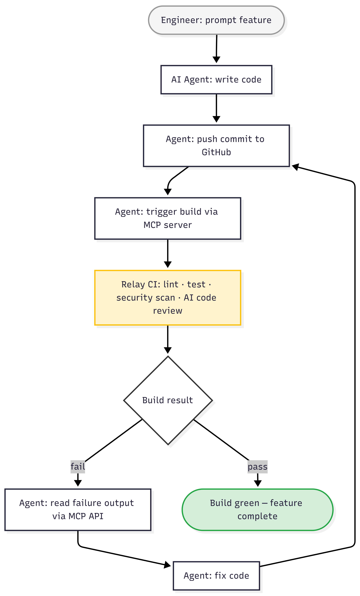

# Auto Coder: An Emerging Pattern in Building Software with AI

*A concise recipe for setting up a recursive generate-test-fix loop where AI builds, breaks, and repairs its own code — without you in the middle.*

---

A pattern is emerging in AI-assisted software development. It goes beyond prompting an AI to write code. It closes the loop — the AI writes code, a CI system tests it, the AI reads the failure, fixes it, and retries. No human between "commit" and "green build."

I used this pattern to build [Relay CI](https://github.com/alexcpn/relay-ci) — a multi-microservice CI system in Go — with Claude Code as the coding agent. The system the AI was building became the system that validated the AI's output. Here is how to set it up for your own projects.

*The recursive loop: generate, test, review, fix, repeat — without human intervention between steps.*

---

## Step 1: Write the Architecture Document

Create a `CLAUDE.md` (or equivalent) in the root of your repository. This is not documentation for humans. It is a system design template that the AI agent loads as context at the start of every session.

**What it should contain:**

- Architecture principles (e.g., microservices, no shared databases)
- Interface contracts (e.g., Protobuf/gRPC between services, not REST)
- Testing expectations (e.g., all tests runnable without external dependencies)
- Anti-patterns to avoid (e.g., no hidden coupling, no utility packages that span services)
- CI conventions (e.g., lint, test, security scan must pass before merge)

**Why this matters:** Without it, the AI drifts across sessions — different patterns, inconsistent error handling, contradictory design decisions. This document is the architectural anchor that survives context compaction.

**Tip:** Use the AI itself in "Plan" mode to draft this document. Describe the system you want, let the AI distill it, then edit and refine. The AI helps write its own instructions.

*The architecture that CLAUDE.md produced — clear boundaries, versioned interfaces, independent services.*

---

## Step 2: Set Up the CI Pipeline

Create a CI pipeline with automated quality gates. The key requirement: **every stage must produce structured, machine-readable output** that the AI agent can parse.

**Minimum stages:**

1. **Lint** — catches style and code quality issues (e.g., `golangci-lint`, `eslint`)
2. **Test** — runs unit and integration tests with clear pass/fail output
3. **Security scan** — static analysis for vulnerabilities (e.g., `gosec`, `semgrep`)
4. **AI code review** — a separate AI instance reviews the code and posts a verdict

You can use any CI system (GitHub Actions, Jenkins, Relay CI, etc.), but ensure the pipeline results are accessible programmatically — via API, CLI, or an MCP server.

**The AI code review stage** is what makes this pattern recursive. A reviewer AI (separate from the coding AI) analyzes the PR and posts findings. Drive it with a [code review skills file](https://github.com/alexcpn/relay-ci/blob/main/code-reviewer.md) checked into the repo — a best-practices prompt that defines what "good code" means for your project.

> *You don't need to write a review prompt from scratch. Community-maintained skills like [obra/superpowers](https://github.com/obra/superpowers/blob/main/skills/requesting-code-review/code-reviewer.md) provide battle-tested review prompts you can adapt.*

---

## Step 3: Add the Guardrails

The CI pipeline from Step 2 catches surface-level problems — lint violations, failing tests, obvious bugs. But there is a deeper guardrail that matters more: **system quality**.

**Code Quality** is handled by Step 2. The `CLAUDE.md` guides the AI's intent; linters, tests, and AI code review verify the output. This covers correctness and style.

**System Quality** — extensibility, maintainability, clean separation of concerns — is the harder problem. Here is the nuance: if the system is not well-structured, the AI agent eventually hits a wall. Beyond a certain feature count, poorly organized code becomes too tangled for the agent to extend without breaking something else. The build starts failing, and the agent cannot fix its way out.

This matters because **the agent is the one maintaining and extending the code**. It needs to:

- Find the right place to make a change without reading the entire codebase
- Add a feature without breaking unrelated services
- Debug failures from structured logs, not guesswork

This only works if the code follows principles that keep it navigable at scale:

- **SOLID and Clean Code patterns** — single responsibility, dependency inversion, clear abstractions. Not for academic purity, but because the AI reasons better about well-factored code.
- **Structured logging** — the agent diagnoses failures by reading logs. If logs are vague or missing, the feedback loop breaks.
- **Small, independent services** — microservice boundaries keep each unit within the AI's context window. The agent can reason about one service end-to-end without loading the entire system.
- **Strict interface contracts** — Protobuf/gRPC or similar. The agent can refactor anything behind an interface as long as the contract holds. Without this, changes cascade unpredictably.

The guardrail is not just "does the code pass tests." It is: "is the code structured so that the AI can keep building on it tomorrow?" If the answer is no, the loop degrades over time — each iteration gets harder, builds fail more often, and the agent spends more cycles fixing regressions than adding features.

This is where the `CLAUDE.md` does its heaviest lifting. It encodes these structural expectations so the agent produces maintainable code from the start — not just code that works today.

%20Triggering%20Build%20with%20MCP.png)
*The AI agent triggers a build of its own code via MCP — but only well-structured code survives repeated iterations of this loop.*

---

## Step 4: Prompt a Feature and Let the Loop Run

With steps 1-3 in place, the workflow becomes:

1. You prompt the AI agent with a feature request
2. The agent writes the code
3. The agent commits, pushes, and triggers a build
4. The build fails — lint violations, test failures, review findings
5. The agent reads the structured failure output
6. The agent fixes each issue
7. The agent pushes again, retriggers, and waits
8. The build passes

**You are not in the loop between steps 2 and 8.**

*The agent reads failure output, diagnoses root causes, and proposes fixes — all through the CI API.*

*The agent fixes violations, commits, pushes, and monitors the next build. The git log reads like a conversation between the agent and the CI system.*

---

## Step 5: Close the Loop — Give the AI Agent Access

With guardrails in place, connect the AI agent to the full cycle. It needs to:

1. **Commit and push** code to the repository (SSH key or token, feature branches)
2. **Trigger builds** programmatically (webhook, CLI, or MCP server)
3. **Read build results** — not just "pass/fail" but specific error messages, line numbers, and review findings
4. **Act on feedback** — fix issues and retrigger

If you are using [Relay CI](https://github.com/alexcpn/relay-ci), the MCP server exposes 10 tools for this — trigger builds, check status, read logs, get review results — all callable by any AI agent.

*AI code review blocks the PR. The coding agent must satisfy the reviewing agent before a human even sees it.*

---

## Why This Pattern Works

Three things make the auto coder loop effective:

1. **Structured feedback.** The AI doesn't get a vague "build failed." It gets specific lint violations, specific test failures, specific review findings — with line numbers. This is what lets it self-correct.

2. **Small blast radius.** Microservices and strict interfaces mean a broken change in one service can't cascade. The AI can reason about one service end-to-end without loading the entire system.

3. **Externalized architectural memory.** The `CLAUDE.md` document survives context compaction. The AI's short-term memory is volatile, but the architectural principles reload fresh every session.

*The full loop completed: all tests pass, code review is green, the system is stable — after multiple rounds of the agent fixing its own mistakes.*

---

## Get Started

1. Write your `CLAUDE.md` — start with 50 lines of architecture principles and grow from there
2. Set up a CI pipeline with structured output — even GitHub Actions with good test reporting works
3. Give your AI agent push access and a way to read build results
4. Prompt a feature, step back, and watch the loop

The pattern is simple. The leverage is enormous.

---

*[Relay CI](https://github.com/alexcpn/relay-ci) is open source. The [CLAUDE.md](https://github.com/alexcpn/relay-ci/blob/main/claude.md) and [architecture document](https://github.com/alexcpn/relay-ci/blob/main/Architecture.md) are included in the repo.*
