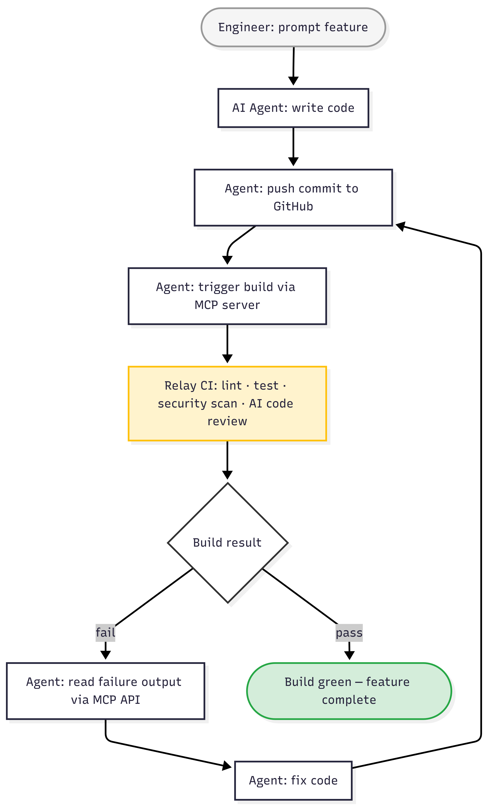

# The Software That Built Itself: Well-Defined Intents Are All You Need

*How one engineer and an AI agent built a CI system that tested, corrected, and extended itself — feature by feature*

---

I started with an empty repository and a question: could one engineer and an AI agent build a production-grade CI system from scratch?

Not a toy. A real system — multiple microservices in Go, DAG-based parallel pipeline execution, webhook-driven builds, AI code review, security scanning, and a full MCP server that any AI agent could call programmatically. Something conceptually similar to Jenkins, but designed for a world where AI agents are first-class participants in the development process.

The system is called [Relay CI](https://github.com/alexcpn/relay-ci). Building it would have previously required a dedicated team and months of runway. I built it with Claude Code in a fraction of that time.

But the more interesting story is not that it got built fast. It is what happened partway through — when the system the AI was building became the system that validated the AI's own output. The tool and the toolmaker merged into a single loop.

---

## 130 Lines of Intent

The single most consequential decision I made was not about technology. It was writing a 130-line document called [CLAUDE.md](https://github.com/alexcpn/relay-ci/blob/main/claude.md) and checking it into the root of the repository.

This is not documentation for humans. It is a system design template that the AI agent loads as context at the start of every coding session. It contains architecture rules, interface contracts, testing expectations, CI conventions, security defaults, and explicit anti-patterns to avoid.

Some examples of what it says:

- Use Protobuf/gRPC for all service interfaces. No REST between internal services.
- Each microservice owns its own data. No shared databases.
- Do not introduce hidden coupling between services.
- All pipeline stages must be independently retriable.
- Tests must be runnable without external dependencies.

Without this document, the AI drifted. It would pick different patterns across sessions — REST in one service, gRPC in another. It would create utility packages that coupled services together. It would make architectural decisions that contradicted earlier ones. Over time, this accumulates as a new form of technical debt that I call *AI slop*.

With CLAUDE.md loaded, the output was architecturally coherent. Not perfect — but coherent. Consistent patterns across services. Consistent error handling. Consistent interface contracts.

Here is the interesting part: the document itself was generated with the AI in "Plan" mode. I described the system I wanted — the constraints, the principles, the architecture — and the AI helped me distill that into a concise, prescriptive template. I then edited and refined it. The AI helped write its own instructions.

*The microservice architecture that CLAUDE.md produced. Each service has clear boundaries, versioned interfaces, and independent deployability.*

---

## The Agent Compacted Its Memory Three Times

The actual development sessions were unlike anything I had experienced before.

The AI agent generated a multi-microservice Go system: an API gateway, a build orchestrator, a DAG-based pipeline executor, an MCP server exposing 10 programmatic tools, webhook handlers, a pipeline DSL parser, and the glue connecting all of them through Protobuf interfaces.

The scale was large enough that the agent hit its context limits. Claude Code had to compact its context three times during the build — summarizing its own work-in-progress to free up room, then continuing from the summary. If you have used these tools, you know the moment: the agent pauses, compresses everything it knows into a condensed representation, and picks up where it left off.

What surprised me was what survived compaction. The architectural decisions remained consistent. Service boundaries held. Interface contracts stayed intact. The Protobuf definitions the agent wrote in session one were still being respected in session three, after two compactions.

This is where CLAUDE.md earned its keep. The agent's episodic memory was volatile — it forgot implementation details, variable names, the specifics of what it had just built. But the architectural principles in CLAUDE.md were reloaded fresh every session. They acted as a stable anchor that the agent could re-derive from, even after losing the details.

What did not survive as well: nuance. After compaction, the agent sometimes lost the thread of why a particular design decision had been made. It would occasionally propose changes that were technically valid but contradicted an earlier judgment call. These moments required human intervention — a quick correction, a reminder of the reasoning. The human's job was not to write code. It was to maintain architectural intent across context boundaries that the AI could not.

---

## The CI System Started Grading Its Own Creator

Then something happened that I had not planned for.

The Relay CI system reached a point where it was functional — it could accept webhook events, parse pipeline definitions, orchestrate build stages in a DAG, and report results back as GitHub commit status checks. At that point, the AI agent could use Relay CI to validate the code it was writing *for* Relay CI.

The development loop became recursive:

1. I prompt a new feature for the CI system
2. The AI agent writes the code
3. The agent pushes a commit
4. The agent triggers a build via the MCP server
5. Relay CI runs lint, test, security scan, and AI code review
6. The build fails — lint violations, test failures, review findings
7. The agent reads the failure output through the MCP API
8. The agent fixes the code
9. The agent pushes again, retriggers, and waits
10. The build passes

No human in the loop between steps 2 and 10.

*The recursive development loop: the AI agent writes, pushes, triggers, reads failure output, fixes, and retriggers — without human intervention between steps.*

%20Triggering%20Build%20with%20MCP.png)
*The AI agent triggers a build of its own code via MCP. It asks the CI system it is building to judge the code it just wrote.*

*When the build fails, the agent diagnoses the problem through the same API — reading structured logs, identifying root causes, proposing fixes.*

The agent was extending the CI system with features I prompted — and the CI system was the feedback mechanism that kept the agent honest. The subject and the judge were the same system, mediated through automated quality gates that neither human nor AI could bypass.

This is not AGI. It is not sentient code. It is something simpler but still striking: a closed loop where the output improves the process that creates the output.

---

## Fix, Push, Rebuild, Repeat — Without Me

Once the recursive loop was established, I watched several episodes that made the implications concrete.

**The 60 lint violations.** The agent generated a batch of new code for the pipeline executor. The linter caught 60 violations. A human developer would have triaged them — some are warnings, some are errors, some are stylistic preferences. The agent did not triage. It read the structured lint output through the CI API, fixed all 60 issues in one pass, committed with the message `fix: resolve all 60 golangci-lint violations`, pushed, retriggered, and moved on. The entire cycle took minutes.

**AI reviewing AI.** This was the episode that made me stop and think. The AI code review stage — itself an AI running inside Relay CI — analyzed a pull request that the coding agent had written. The reviewer found issues: insufficient error handling in a gRPC interceptor, a missing context cancellation check, a security concern in the webhook validation path. It posted a "Not ready to merge" verdict as a GitHub commit status check.

Here is an example of AI code review [triggered for a PR](https://github.com/alexcpn/relay-ci/pull/1#issuecomment-4076818573), with auto-gating by Relay CI. The review is driven by a [code review skills file](https://github.com/alexcpn/relay-ci/blob/main/code-reviewer.md) — a best-practices prompt checked into the repo — and executed by the [code-review pipeline phase](https://github.com/alexcpn/relay-ci/blob/main/pipeline.yaml#L84-L91).

> *Note: You don't need to write a custom code review prompt from scratch. Community-maintained skills like [obra/superpowers](https://github.com/obra/superpowers/blob/main/skills/requesting-code-review/code-reviewer.md) provide battle-tested review prompts that can be used directly or adapted to your project's needs.*

The coding agent read the review feedback through the MCP API and corrected each issue. Two different AI processes — one creating, one reviewing — with a human-designed quality gate between them.

*Two distinct AI agents: the coding agent (blue) and the reviewer agent (orange), separated by an automated quality gate neither can bypass.*

*The agent fixes violations, commits, pushes, and triggers a fresh build — then monitors it. The git log reads like a conversation between the agent and the CI system.*

*AI code review blocked this PR. The review stage found issues and posted "Not ready to merge." The agent that wrote the code had to satisfy the agent that reviewed it.*

**The autonomous correction cascade.** In one session, I prompted a feature and then watched a sequence unfold without any further input from me: the agent wrote the code, pushed, triggered a build, the build failed on three stages, the agent read all three failure reports, made targeted fixes for each, pushed a single commit addressing all of them, retriggered, and the build went green. The commit history tells the entire story.

A key observation: this only worked because the architecture was right. Microservices meant small blast radius — a broken change in the pipeline executor could not cascade into the API gateway. Strict Protobuf interfaces meant changes behind a service boundary could not silently break its neighbors. Automated test suites meant the AI got fast, specific feedback on what broke and why. The "good practices" encoded in CLAUDE.md were not optional polish. They were load-bearing infrastructure for AI autonomy.

---

## It Is Not Magic — But it Feels Pretty Close

I want to be honest about what this experiment proves and what it does not.

**What was essential:**

- **CLAUDE.md** as the architectural anchor. Without it, the AI produced code that worked but drifted into incoherence across sessions.
- **Microservice boundaries** that kept each service within the AI's context window. The agent could reason about one service end-to-end without loading the entire system.
- **Protobuf/gRPC contracts** that enforced interface compatibility. The AI could refactor anything behind an interface — as long as the contract held.
- **Automated pipeline stages** that gave the AI structured, machine-readable feedback. Not a vague "build failed" — specific lint violations, specific test failures, specific review findings.
- **The MCP server** that exposed 10 tools for programmatic CI interaction. Without this, the agent could write code but could not close the feedback loop.

**What the human did:**

I did not write code. I wrote the design template, chose the architecture, defined the service boundaries, decided what quality gates to enforce, and prompted features. I was the architect; the AI was the engineering team. When the agent lost thread after a context compaction, I corrected course. When a design decision needed judgment that the template did not cover, I made the call.

The human's job was to encode judgment into a system of constraints — the template, the architecture, the interfaces, the gates — and then let the AI execute within those constraints.

**What was hard:**

Context compaction meant the AI sometimes lost nuance. Some service boundary decisions required iteration — the agent's first proposal was not always the right one. The pipeline DSL design went through several rounds before it was clean. The 60-lint-violations episode exists because the first pass was wrong. Not everything worked on the first try. The loop corrected for that — but the loop itself needed to be designed.

**What this does not prove:**

This does not prove that AI can build arbitrary software without humans. It proves that a disciplined architect with a clear design template and the right infrastructure can use AI to build a system that would have previously required a team. The human judgment was compressed into the template and the architecture — not eliminated.

*The full loop completed: all 177 tests pass, code review is green, the system is stable. This screenshot came after multiple rounds of the agent fixing its own mistakes.*

---

## The System That Built Itself — With Guardrails

So: can one engineer and an AI build a production-grade CI system? Yes.

But the more interesting answer is about the loop that emerged. The software did not just get built. It got built, tested, broken, diagnosed, fixed, and improved — in a closed cycle where the AI was both the builder and the subject of the build system's judgment.

This is what AI-native software engineering looks like in practice. Not AI writing code while humans review it. Not "vibe coding" where you prompt and pray. A system where AI builds, AI tests, AI reviews, and AI corrects — within guardrails that a human architect designed.

The real lesson is not about speed. It is about what happens when you combine clear architectural intent, disciplined engineering practices, and AI execution in a feedback loop that runs faster than any human team could manage. The system improves itself. Not in a science-fiction sense — in an engineering sense. Each cycle through the loop produces better code, better tests, and a more resilient system.

The software built itself. But only because someone built the blueprint first.

---

*[Relay CI](https://github.com/alexcpn/relay-ci) is open source. The [CLAUDE.md](https://github.com/alexcpn/relay-ci/blob/main/claude.md) that guided the AI and the [architecture document](https://github.com/alexcpn/relay-ci/blob/main/Architecture.md) are included in the repo.*

